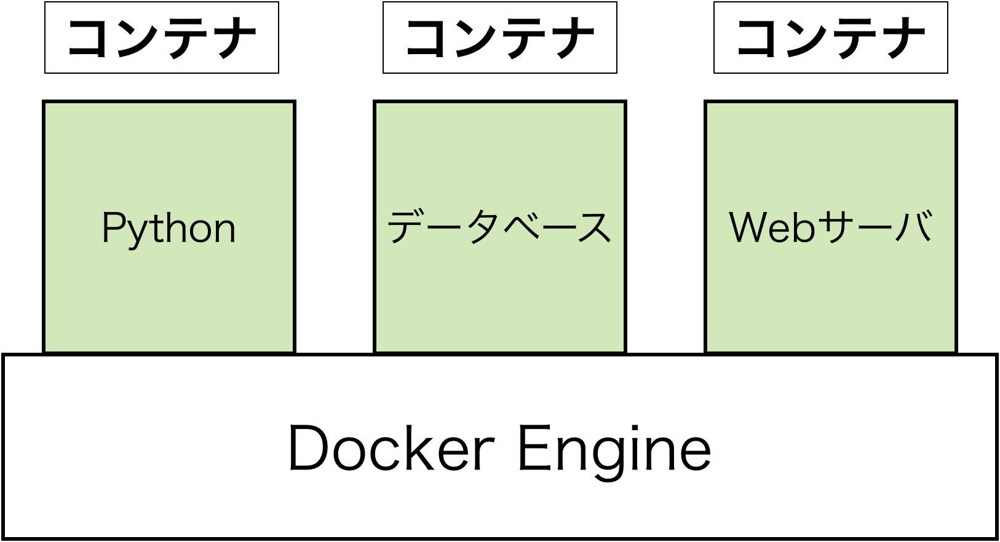
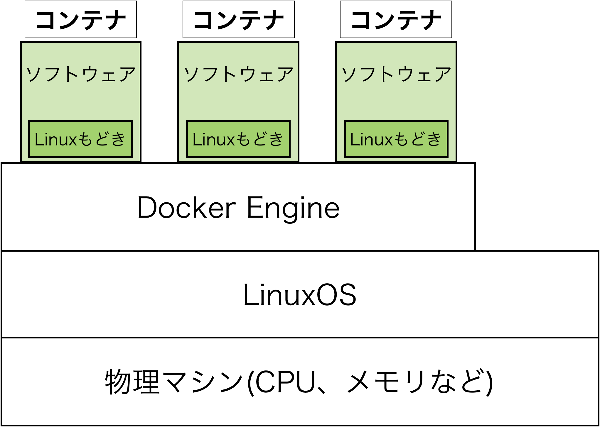
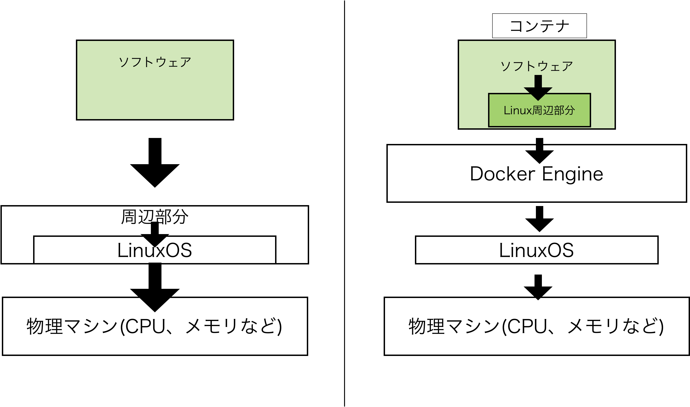

# Dockerの基礎


## はじめに
本資料は，Dockerについて知らない方がDockerの基礎を学ぶためのものである．

## 1. Dockerとは
本章では，Dockerについて要点を絞って説明する．

### 1.1 Dockerとは

Dockerとは**データやプログラムを隔離する**仕組みである．サーバでは様々なソフトウェアが動いているが，Dockerを使うことでソフトウェアのプログラムやデータを，それぞれ独立した環境に隔離できる．この独立した環境を**コンテナ**と言う．Dockerはこのコンテナを操作するソフトウェアである (このソフトウェアの名前を **Docker Engine** という) ．

コンテナのイメージ図は下記の通りである．



図. Docker Engineとその上にあるコンテナ

ここで一つ注意してほしいのが，サーバという意味は二つある．

- 物理マシンとしてのサーバ
    - 個人のパソコンと基本的には同じもので，スペックがよくなったパソコン
- 機能を提供するサーバ
    - ソフトウェアによって機能が使えるようになる
    - 一つの物理マシンとしてのサーバに複数存在することができる．

以上のことをまとめると，物理マシンとしてのサーバには，複数のソフトウェアをインストールすることで機能を提供するサーバを複数実行することが可能である．つまり，一つのマシンで複数の機能をユーザに提供できる．複数のソフトウェアをインストール・実行する時にDockerが大活躍する．

### 1.2 Dockerの特徴とメリット・デメリット，使い道

Dockerの根幹は「隔離できること」にある．隔離できることで以下の3つの特徴を持つ．

1. 独立している
    1. 複数のソフトウェアを実行できる
2. 雛形 (イメージ) を作ることができる
    1. 持ち運びできる→他人に環境を配布できる
    2. 保存・変更が容易→アップデートしやすい，ソフトウェアを変更しやすい
3. カーネルがない
    1. 軽量
    2. LinuxOSを変えることが可能

### Dockerのメリット・デメリット

次にメリットとデメリットを紹介する．

- メリット
    - 1台の物理マシンに複数のサーバを稼働することができる．
    - サーバの管理がしやすい．
    - コマンドを使うことでソフトウェアを使うことができる．
    - 同じソフトウェアを一つの物理マシンで複数使うことができる
- デメリット
    - コンテナ内はLinuxOSしか使えない (コンテナ内をWindowsにすることは不可)
    - 物理マシンが故障した時に影響が非常に大きくなる (すべてのソフトウェアが使えなくなるため)

### Dockerの使い道

以上の特徴とメリットから，Dockerの使い道を紹介する．

- 必要な環境を容易に整えることができる．
    - 有名なソフトウェアを搭載したDockerイメージ(雛形)が公開されている．
- 開発者に同じ開発環境を迅速に提供することができる．
    - 1台1台環境構築する必要なく，コマンドを打ち込むことで環境を作ることができる．
- 別のバージョンを一つの物理マシンで共有することができる．
    - 新しいバージョンの機能を試したい時に便利だ．

### 1.3 Dockerの仕組み

少し詳しくDockerの中身を説明する．1.1ではDocker Engineの上にコンテナがあると説明したが，もう少し深掘りする (といってもかなり簡略化して書いている) ．

物理マシンの上にLinuxOSがある．OSの上に様々なソフトウェアなどが載せられており，その内の一つがDocker Engineとなる．そしてDocker Engineから個別に分離されてコンテナが稼働している．ここで，コンテナ内には**Linuxもどき**が入っている．Linuxもどきとは，完全なLinuxではないが，Linuxのようなものだ．



図. 物理マシンとLinuxOS，Docker Engineとコンテナの関係性

OSは，ソフトウェアとハードウェアの中間にいてそれぞれの間を仲介してくれるものだ．そしてLinuxOSは，ざっくりと**カーネル**とそれ以外の周辺部分(シェルやデーモンなど)に分けることができる．通常のLinuxマシンとDockerコンテナの大きな違いは，カーネルを持つか持たないかだ．Dockerコンテナ内のLinuxはカーネルを持たず，周辺部分だけを持つ．ですので上記でLinuxもどきと書いた．この違いを図に表すと下のようになる．



図. 左が通常のLinuxマシン，右がDockerを使ったソフトウェアとハードウェアの繋がり

DockerはLinuxOS上のソフトウェアとして動き，Dockerコンテナ内は土台のLinuxを使って動いていることがわかる．つまり，DockerはLinux用のソフトウェアになる．しかしながら，WindowsやMacでもDockerを使うことは可能だ．これは何らかの形でWindowやMacにLinuxOSを入れることで，使えるようにしている．

### 1.4 イメージとコンテナ

Dockerで重要な2つの用語を説明する．それはイメージとコンテナになる．イメージはコンテナを作る雛形だ．コンテナはイメージから作られた実体になり，ユーザが実際に使うものになる．イメージを共有することで，同じコンテナを自由に作ることができる．実は，作成したコンテナからイメージを作ることもできる．実際にDockerを使う上で，イメージとコンテナを区別しておくことで何をしているか分かりやすくなるので，覚えておいてほしい．

### 補足 DockerHub

Dockerのイメージは，DockerHub ([https://hub.docker.com](https://hub.docker.com/)) で公開されている．イメージを最初から作ることはなく，ベースとなるイメージをDockerHubからダウンロードし，それを元にイメージを自分なりにカスタマイズすることがほとんどだ．DockerHubには，様々なソフトウェアを実行するイメージが公開されているが，基本的にはDocker公式やソフトウェアを開発・管理している企業・団体が提供している公式イメージを使うようにしよう．

## 2. Dockerを使ってみる
## 2.1 Hello, Docker

それでは実際にDockerを使ってコンテナを起動させてみよう．まずは一番初めに使われる， `hello-world` というイメージを使ってコンテナを起動させる．

```bash
docker container run hello-world
```

以下のような結果が表示される．

```bash
Hello from Docker!
This message shows that your installation appears to be working correctly.

To generate this message, Docker took the following steps:
 1. The Docker client contacted the Docker daemon.
 2. The Docker daemon pulled the "hello-world" image from the Docker Hub.
    (amd64)
 3. The Docker daemon created a new container from that image which runs the
    executable that produces the output you are currently reading.
 4. The Docker daemon streamed that output to the Docker client, which sent it
    to your terminal.

To try something more ambitious, you can run an Ubuntu container with:
 $ docker run -it ubuntu bash

Share images, automate workflows, and more with a free Docker ID:
 https://hub.docker.com/

For more examples and ideas, visit:
 https://docs.docker.com/get-started/
```

## 2.2 Dockerコマンド

Dockerの基礎的なコマンドを紹介する．

### コマンドの書式

```bash
docker <上位コマンド> <副コマンド> <オプション> <対象> <引数>
```

- 上位コマンド
    - 「何を」に該当するコマンドである．
    - `container` や `image` などがある．
- 下位コマンド
    - 「どうする」に該当するコマンドである．
    - 上位コマンドに合わせていろいろなコマンドがある
- オプション
    - 下位コマンドに対して細かい設定をするものである．
    - `-` や `--` から始まることが一般的だが， `-` 記号をつけないケースもある． ( `-` の数はコマンド作成者の好みで分かれる．)
    - コマンドに値を渡したい場合，オプションの後ろにオプション値を記述する．
        - `--name python` のように書く．
    - `-`のオプションはまとめて書くことができる．
        - `-d -i -t` は， `-dit` と書ける．
- 対象
    - 具体的な名前を指定する
- 引数
    - 対象に対して，持たせたい値を書く．
    - あまり使用する機会はないが，使用するイメージに合わせて指定する．

補足として、一部のコマンドは上位コマンドを省略することもできる．どちらを使っても良いが，最初は何を対象にしているのか間違えないために，上位コマンドを書いておくと良いだろう．

例えばよく使うコマンドは下記になる．

```bash
docker container create --name hello-container hello-wolrd
```

これは， `hello-world` というイメージから `hello-container` という名前のコンテナを作成する．

```bash
docker container start hello-container
```

これは， `hello-container` という名前のコンテナを開始する．

以下から，基本的なコンテナとイメージ操作関連のコマンドを紹介する．他にもボリュームやネットワーク操作に関連するコマンド， Docker Swarm (オーケストレーション機能) に関連するコマンドがあるが，ここでは省略する．

### コンテナ操作関連コマンド (`container`)

| 副コマンド | 内容 |
| --- | --- |
| `ls`  | コンテナ一覧を表示する． (`-a` オプションをつけることが多い) |
| `start` | コンテナを開始する |
| `stop` | コンテナを停止する |
| `create` | イメージからコンテナを作成する |
| `rm` | 停止したコンテナを削除する |
| `cp` | コンテナとホスト間でファイルをコピーする |
| `run` | イメージを取得し，コンテナを作成して，開始する． `docker image pull` ，  `docker container create` ， `docker container start` をひとまとめにしたコマンド． |

### イメージ操作関連コマンド (`image`)

| 副コマンド | 内容 |
| --- | --- |
| `pull` | リポジトリからイメージをダウンロードする |
| `rm` | イメージを削除する |
| `ls` | イメージ一覧を表示する |
| `build`  | イメージを作成する |

## 2.3 コンテナの作成・削除と起動・停止

コンテナのライフサイクルは下記になる．

1. イメージのダウンロード (`docker image pull` )
2. 以下のサイクルを回す
    1. イメージからコンテナの作成 (`docker container create` )
    2. コンテナの起動 (`docker container start` )
    3. コンテナの停止 ( `docker container stop` )
    4. コンテナの破棄 (`docker container rm` )
3. 不要になったイメージの削除 ( `docker image rm` )

しかしながら、実際のところ(1と)2の全てを， `docker container run --rm` でまとめて行うことがほとんどだ。その理由は、コンテナはイメージがあればすぐに作り直せるからだ．コンテナを起動しておくと、その分ハードウェアのリソースを使うため、使わない時は削除しておきたい．そうした理由から、2のサイクルをぐるぐると回すことになる．

### 実際にコンテナのライフサイクルを回す

それでは実際にライフサイクルを回してみよう．今回、コンテナ内でPythonインタプリタを実行する．使用するイメージは `Python` になる． (DockerHubから、公式イメージを取得する)．イメージのタグ (バージョンのことだ) は，3.12.3を使う．

イメージのダウンロード

```bash
docker image pull python:3.12.3    # pythonイメージのタグが3.12.3をダウンロードします．
```

イメージ一覧を表示する

```bash
docker image ls
```

コンテナを起動する

```bash
docker container run -i -t --rm python:3.12.3
```

そうすると，Pythonのインタプリタが表示される．Pythonの exit 関数で Pythonを終了すると、コンテナが停止し、コンテナが削除される．

オプションの意味は下記である．

- `-i` : コンテナに操作端末を繋ぐ
- `-t` : 擬似ttyを割り当てる
- `--rm` : コンテナ終了後，コンテナを削除する

## 3. より高度なDockerの使い方

Chapter02では，Dockerコマンドを使ってイメージからコンテナを作っていた．ここではさらにDockerを使い込むための手法を簡単に紹介する．3.1では，イメージを自分で作るDockerfileを紹介する．3.2や3.3では，Docker ComposeやKubernetesといったDockerで複雑なことをする際に便利になるツールを紹介する．いずれも概要とメリットを紹介する程度にとどめる．

### 3.1 Dockerfile

Dockerfileとは，イメージを作成するためのファイルである．基となるイメージをベースにして，コンテナに対して実行したい様々なコマンドを記述する．その後，Dockerfileに従って，イメージを作成する．Dockerfileからイメージを作成することを**ビルド**という．

Dockerfileに書く内容

```docker
FROM <イメージ名>
RUN <コマンド>
COPY <コピー元パス> <コピー先パス>
...
```

Dockerfileからイメージをビルドするコマンド

```bash
docker build -t <作成するイメージ名> <Dockerfileのパス>
```

### 3.2 Docker Compose

Docker Composeとは，定義ファイルに従って複数のコンテナを一つのコマンドで作ったり消したりする機能である．定義ファイルはYAML形式のファイルで，コンテナやその周辺のネットワークやボリュームの設定を書き込む．Docker Composeを用いない場合，コンテナ・ボリューム・ネットワークなどそれぞれコマンドを実行する必要があるが，Docker Composeを用いると一回のコマンドでまとめて実行できる．なお，Docker ComposeはDockerコマンドとして使えるようになっている．

```bash
docker compose up      # コンテナ・ネットワーク・ボリュームを作成する
docker compose down    # コンテナを削除する．ネットワークやボリュームは停止され，削除されない
```

補足だが，Dockerfileはイメージを作成する機能で，Docker Composeはコンテナとその周辺環境を作成・消去するものである．
また，YAMLファイルはスペースが意味をもちますので注意すること．

### 3.3 Kubernetes

Kubernetes (クーベネティス; k8s)とは，コンテナのオーケストレーションツールである．Dockerとは異なるツールになっている．オーケストレーションツールとは，システム全体を統括し，複数のコンテナを管理できるものである．

Kubernetesが活躍するのは，大きなシステムになる．大きなシステムとは，物理マシン・仮想マシンが一台だけでなく，複数のマシン上で稼働しており，そしてそのそれぞれのマシンの中に，複数のコンテナが存在しているというシステムになる．Kubernetesは，一度作成した定義ファイルに基づき，この複数マシン・複数コンテナを自動で管理する．もし，Kubernetesを使わない場合，マシンに接続してDocker Composeなどを使ってコンテナを立ち上げて，を何回も繰り返すことになる．そしてすべてのマシンを管理して，トラブルが起きればコンテナを作り直して，を行うことになるかもしれない．Kubernetesはそうした複数マシン・複数コンテナの管理を行ってくれるツールになる．


### 3.4 devcontainer
devcontainerとは，Microsoft社が開発しているVisual Studio Code (VSCode) の拡張機能として開発されたツールである．
プロジェクト内の`.devcontainer/devcontainer.json`ファイルにコンテナの設定を書くことで，開発に必要なツール・ライブラリ・ランタイム・拡張機能をコンテナ内にインストールされた状態で，VSCodeの画面でコンテナ環境で開発することができる．
devcontainerを使うことで，開発環境を簡単に構築できるようになり，他人と開発環境を共有することも可能である．
また，プロジェクトごとに開発環境を分けることができるため，開発者ごとに異なる環境で開発することも可能になる．
- [https://code.visualstudio.com/docs/devcontainers/containers](VSCode公式ドキュメント)