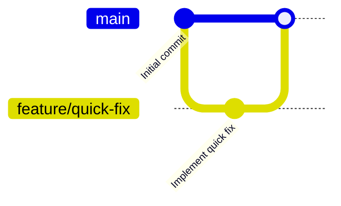
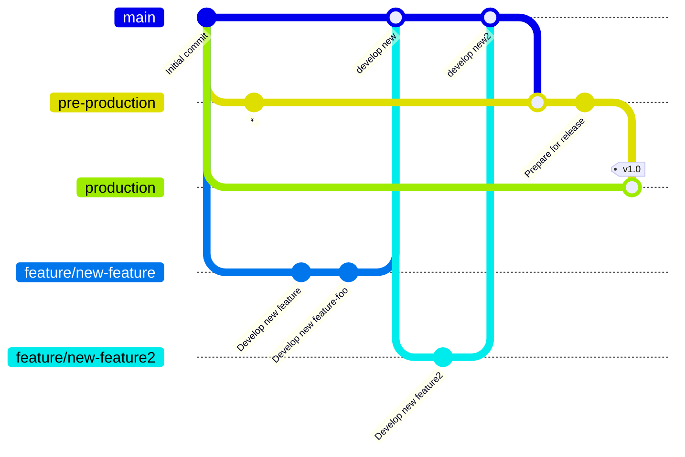
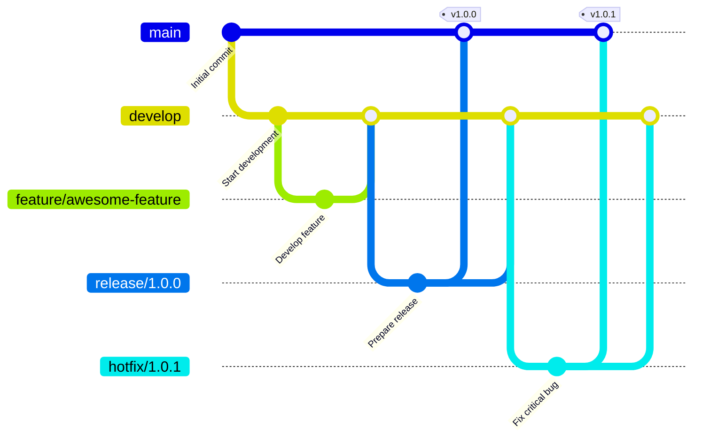
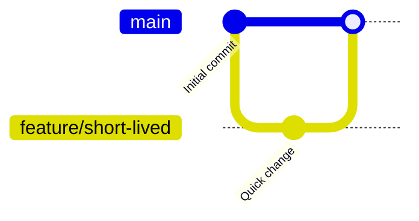
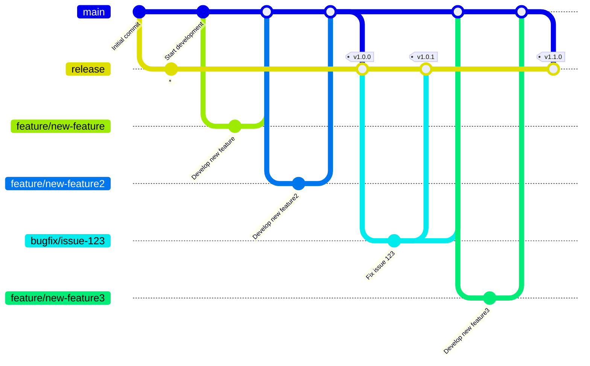
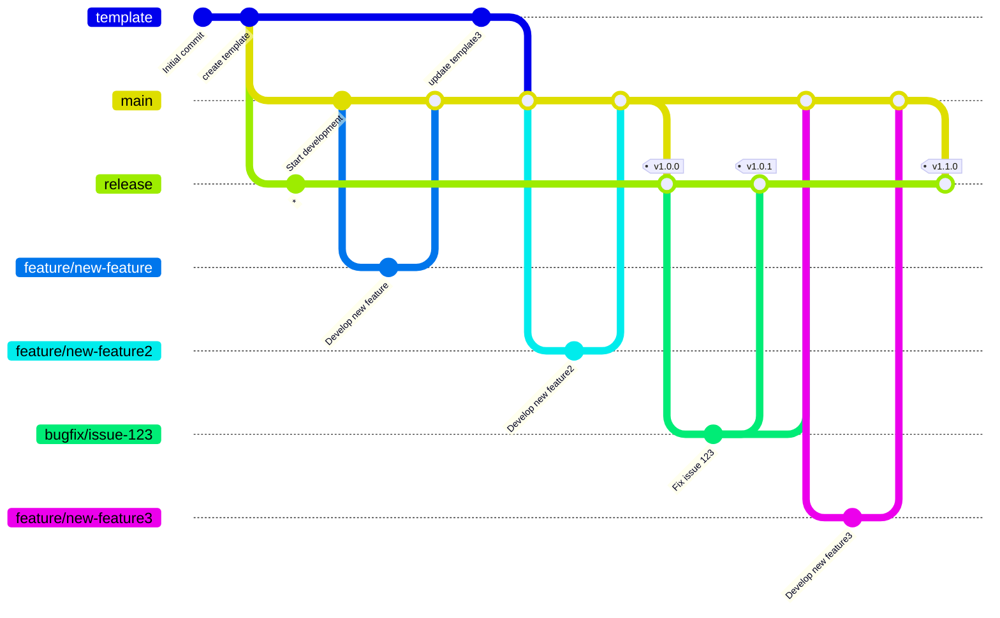

# Gitブランチ戦略

Gitのブランチ戦略は，開発プロジェクトにおけるコード管理やリリースプロセスを効率化するための方法論である．
ブランチ戦略を適切に選択することで，開発チームはコードの変更を効果的に管理し，リリースサイクルを短縮し，品質を向上させることができる．
本ドキュメントでは，一般的なGitブランチ戦略を紹介し，それぞれの特徴や適用条件を説明し，各個人の開発スタイルに合わせた自作のブランチ戦略を考えるための参考とする．

- [Gitブランチ戦略](#gitブランチ戦略)
  - [一般的なフロー](#一般的なフロー)
    - [GitHubフロー](#githubフロー)
    - [GitLabフロー](#gitlabフロー)
    - [Gitフロー](#gitフロー)
    - [トランクベース開発](#トランクベース開発)
  - [自作フロー](#自作フロー)
    - [開発フロー](#開発フロー)
    - [フォークを用いた開発テンプレートの利用時](#フォークを用いた開発テンプレートの利用時)

## 一般的なフロー

### GitHubフロー
GitHub Flowは，シンプルなブランチ戦略で，以下のブランチを使用する．
- main：常にデプロイ可能な状態を保つブランチ．
- feature/*：新機能や修正を行うブランチ．mainから派生し，作業後にPull Requestを通じてmainへマージする．

適した開発条件
- 小規模チームやスタートアップ．
- 継続的デリバリー（CD）を実践しているプロジェクト．
- 短いリリースサイクルや頻繁なデプロイを行う場合．

### GitLabフロー
GitLab Flowは，Git FlowとGitHub Flowの中間的な戦略で，以下のブランチを使用する．
- main：開発の主軸となるブランチ．
- feature/*：新機能や修正を行うブランチ．mainから派生し，作業後にmainへマージする．
- pre-production：ステージング環境用のブランチ．mainからマージし，リリース前の最終確認を行う．
- production：本番環境用のブランチ．pre-productionからマージし，リリースを行う．

適した開発条件
- 中〜大規模のプロジェクト．
- ステージング環境を経て本番環境へリリースするフローを持つ場合．
- 継続的インテグレーション（CI）と継続的デリバリー（CD）を組み合わせた運用．

### Gitフロー

Git Flowは，Vincent Driessen氏が提唱した体系的なブランチ戦略で，以下のブランチを使用する．
- main：本番環境にリリースされるコードを管理する．
- develop：次のリリースに向けた開発を行うブランチ．
- feature/*：新機能の開発用ブランチ．developから派生し，開発後にdevelopへマージする．
- release/*：リリース準備用ブランチ．developから派生し，最終調整後にmainとdevelopへマージする．
- hotfix/*：本番環境での緊急バグ修正用ブランチ．mainから派生し，修正後にmainとdevelopへマージする．

適した開発条件
- 大規模プロジェクトや計画的なリリースサイクルを持つプロジェクト．
- 複数の開発者が並行して作業するチーム．
- 本番環境と開発環境を明確に分離したい場合．

### トランクベース開発
トランクベース開発は，main（またはtrunk）ブランチを中心に開発を進める戦略で，以下の特徴がある．
- 開発者はmainブランチに直接コミットするか，短命のブランチを使用して作業後すぐにmainへマージする．
- フィーチャーフラグや条件分岐を活用して，未完成の機能を本番環境に影響を与えずにデプロイ可能とする．

適した開発条件
- 継続的デリバリー（CD）を強く推進するプロジェクト．
- 高頻度のデプロイやリリースを行う必要がある場合．
- 小規模チームやアジャイル開発を実践しているチーム．

## 自作フロー
### 開発フロー
今回，自分の開発スタイルに合わせたブランチ戦略を考える．
Gitフローはブランチ戦略が複雑であり，GitHubフローはブランチ戦略がシンプルすぎるため，その中間的なGitLabフローをメインに考える．
一方で，GitLabフローのpre-productionブランチについて，リリース前の確認のためにブランチを作成する必要ないと考える．
一方で，リリース後のバグ修正のために，bugfixブランチを作成する必要があると考える．
よって，以下のブランチ戦略を採用する．
今回，
- main：開発の主軸となるブランチ
- release：リリースブランチ．mainからマージされる．バージョンごとにタグをつけていく
- feature/*：新機能や修正を行うブランチ．mainから派生．
- bugfix/*：バグ修正用ブランチ．releaseから派生．修正後にmainとreleaseへマージする．

補足
- コミットIDの "*" は，gitGraphを書くために無理やりつけたものであり，実際のgitでは存在しない．

### フォークを用いた開発テンプレートの利用時
開発テンプレートが別のリポジトリにあり，それをフォークして開発を行う場合，以下のブランチ戦略を採用する．

- template：テンプレート開発のリポジトリ
- main：開発の主軸となるブランチ
- release：リリースブランチ．mainからマージされる．バージョンごとにタグをつけていく
- feature/*：新機能や修正を行うブランチ．mainから派生．
- bugfix/*：バグ修正用ブランチ．releaseから派生．修正後にmainとreleaseへマージする．

