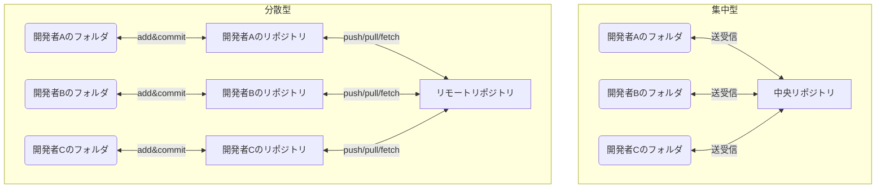
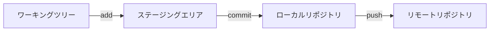

# Gitの基礎

この資料はGitについて知らない読者向けにGitの基本的な使い方を説明するものである。
近年のあらゆる開発において，ファイルのバージョン管理は必須になっている．
Gitはバージョン管理ツールのデファクトスタンダードとして，研究．企業を問わず様々な開発現場で利用されている．
ここでは，バージョン管理の必要性を説明し，Gitの基本的な概念やコマンドを紹介する．
Gitを用いる利点を知り，Gitの基本的な操作方法を身につけて，他者の助けを得ながらGitを開発に活用できるようになることを目的とする．

## バージョン管理の概要
バージョン管理とは，ファイルの変更履歴を記録し，過去の状態に戻したり，変更内容を比較したりするための仕組みである．
バージョン管理システムを用いることで，以下のようなことができる．
- いつ・誰が，どういう目的で，どういった変更を行ったのかを記録できる。
- 過去の状態に戻すことができる。
- 複数人での共同作業が容易になる。
- 変更内容を比較し、差分を確認できる。
- 複数人で異なる作業を並行して進めることができる。

バージョン管理システムを使わずにファイルの履歴を保存するには，例えば，定期的に手動で全フォルダをコピーしてバックアップを取り管理するという方法もある．
バージョン管理システムを使う場合と使わない場合のメリット・デメリットを比較する．

|   | メリット   | デメリット |
|---------|-------|--------|
| バージョン管理システム| - 変更履歴を管理できる。 - 複数人での共同作業が容易である。 | - 導入や学習に時間がかかる． - 運用ルールが必要である． |
| 使わない場合 | - 導入や学習の手間が不要である。 - 小規模な作業では手軽である。 | - 変更履歴の管理が困難である。 - 複数人での共同作業が難しい． |

### バージョン管理システムの種類
バージョン管理システムには，以下の2種類がある．
現在，多くのプロジェクトで利用されているのは分散型バージョン管理システムである．

- 集中型バージョン管理システム
  - リポジトリが中央サーバーに存在し，開発者はそのサーバーにアクセスして作業を行う．
    - 例：CVS，Subversion(SVN)
  - メリット
    - 管理が一元化されるため，運用ルールの徹底が容易である
    - 履歴の管理やバックアップが中央で行える。
  - デメリット
    - サーバーがダウンすると作業ができなくなる。
    - ネットワーク接続が必須である。
- 分散型バージョン管理システム
  - リポジトリが各開発者のコンピュータに存在し，開発者はそれぞれ独立して作業を行う．
  - 必要に応じてリモートリポジトリ(GitHub, GitLab)を用意して，作業を共有する．
    - 例：Git，Mercurial，Bazaar
  - メリット
    - ネットワークがなくても作業や履歴の参照が可能である。
    - サーバー障害時も作業が継続できる。
  - デメリット
    - 履歴や運用ルールの一貫性を保つ管理がやや複雑である。
    - リポジトリの管理が分散するため，混乱が生じる場合がある。

## Gitの概要
GitはLinus TorvaldsがLinux開発のために作成したバージョン管理システムである。
Gitは分散型のバージョン管理システムのデファクトスタンダードとして広く普及しており，多くのプロジェクトで利用されている．
特に，オープンソースプロジェクトではGitHubを通じて多くのプロジェクトが公開されている．

## 基本用語
Gitを学ぶ上で基本的な用語を以下に示す。

- リポジトリ(repository)
  - ファイルやディレクトリの変更履歴を保存する場所
  - 各自のローカル環境にあるリポジトリをローカルリポジトリという
  - GitHubやGitLab等のホスティングサービスにあるリポジトリをリモートリポジトリという
- コミット(commit)
  - ファイルの変更内容を記録する操作
  - こまめにコミットすることが大事である
- ブランチ(branch)
  - 作業の流れを分岐させる機能
  - 複数人での開発や新機能の追加時に利用
- マージ(merge)
  - 異なるブランチの変更内容を統合する操作
  - 通常はGitが自動でマージを行うが、競合(コンフリクト)が発生する場合は手動で解決する必要がある
- ワーキングツリー(作業ディレクトリ)
  - 現在作業している場所
- ステージングエリア(インデックス)
  - 作業ディレクトリで変更したファイルをコミットする前に一時的に保存する場所

### 変更内容を変更履歴に保存するまでの流れ

Gitでファイルの変更内容をリポジトリに保存するまでの流れは以下である．

## Git Tour
Gitを使う手順を紹介する．
実際に作業する場合，リモートリポジトリ編では，GitHubやGitLabを用意する．

### Gitの初期設定
1. Gitのインストール方法は公式サイトを参照すること
2. ユーザ設定を行う
3. 

### ローカルリポジトリ編
1. 作業ディレクトリを作成する
1. リポジトリを作成する
   1. `git init`

### リモートリポジトリ編

