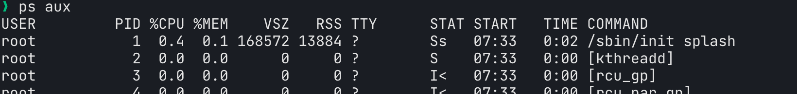

# Chapter06 プロセス・ジョブ

Linuxを含め多くのOSでは，複数のプログラムを同時に並行して実行できるマルチタスク機能が搭載されている．例えば，プログラム処理をしながら別のファイルを編集したり，複数人でLinuxサーバに同時にアクセスして別々の作業をすることができる．Linuxが自動的に処理を管理するが，途中で処理を打ち切りたくなる場合もある．6.1ではプロセスの説明と確認方法を，6.2ではジョブについて，6.3ではプロセスやジョブを終了する方法を説明する．

## 6.1 プロセス

プロセスとは動作中のプログラムを指す．Linuxカーネルはディスクから実行ファイルを読み出してメモリに格納し，そのメモリ内容に従ってCPUがプログラムを実行する．このメモリ上で実行状態にあるプログラムがプロセスである．

Linuxカーネルは各プロセスにプロセスIDを設定し，適切に管理する．プロセスには実行ユーザが設定されており，他人のプロセスを勝手に操作できないようになっている．

Linuxではプロセスは無から発生するのではなく，既存のプロセスをもとに作成される．例えばシェルから`whoami`コマンドを実行する場合，シェルが親プロセスとなり，そのプロセスから`whoami`コマンドのプロセスが子プロセスとして実行される．最初のプロセスはカーネル初期化後に起動される`init`である．

### プロセスの表示

書式

```bash
ps <オプション>
```

オプション(BSDオプション)

- `x` : `ps`コマンドを実行したユーザのプロセスをすべて表示
- `ux` : `ps`コマンドを実行したユーザのプロセスすべてを詳細に表示
- `ax` : すべてのユーザのプロセスを表示
- `aux` : すべてのユーザのプロセスを詳細に表示

ハイフンが不要なことに注意する．

例

```bash
ps aux    # コマンドを実行したユーザのプロセスを詳細に表示
```



- USER: 実行ユーザ
- PID: プロセスID
- %CPU・%MEM: CPUとメモリ使用率
- TIME: 実行経過時間
- COMMAND: 実行コマンド

## 6.2 ジョブとは

ジョブとはシェルから見た処理の単位である．プロセスはLinuxカーネルから見た処理の単位である．コマンドが1つだけの場合，ジョブとプロセスは同じだが，`|`(パイプ)でコマンドを繋いだ場合，プロセスはコマンドごとに生成されるが，ジョブはコマンドライン全体で1つとなる．

下記コマンドではジョブは1つだが，プロセスは2つ生成される．

```bash
ps aux | head
```

ジョブはシェルごとにジョブ番号を持つため，ジョブ番号は重複することもある．一方，プロセスはシステム全体で一意のプロセスIDを持つ．

シェルを使うことでジョブを一時停止させたり，バックグラウンドで実行させたりできる．

### ジョブの状態

ジョブには3つの状態がある．

- 停止: 処理を一時的に中断している状態
- フォアグラウンド: ユーザが対話的に操作しながら処理が実行されている状態
- バックグラウンド: ユーザが対話的に操作せず処理が実行されている状態

### ジョブを停止する

フォアグラウンド状態のジョブを停止するには`C-z`を使う．

例

```bash
man ls    # lsコマンドのマニュアルを表示
# Control+zでman lsコマンドが停止する
jobs    # ジョブの確認
vim ~/.bashrc    # ファイルを編集
# C-zでvimコマンドを停止
jobs
# man lsとvim ~/.bashrcコマンドのジョブが停止している
```

### ジョブをフォアグラウンドにする

書式

```bash
fg %<ジョブ番号>
```

例

```bash
fg %1    # man lsコマンドをフォアグラウンドにする
# qでマニュアルを終了
fg %2    # vimコマンドをフォアグラウンドにする
# :q!でVimを終了
```

### ジョブをバックグラウンドにする

処理に時間がかかるものやユーザが対話的に操作する必要がないものはバックグラウンドで処理できる．

停止中のジョブをバックグラウンドで実行する場合，`bg`コマンドを使う．

書式

```bash
bg %<ジョブ番号>
```

最初からジョブをバックグラウンドで処理したい場合，コマンド末尾に`&`を付ける．

例

```bash
vim ~/.bashrc &
jobs
```

## 6.3 プロセス・ジョブを終了する

間違ったコマンドを実行したり，プログラムのバグでコマンドが操作を受け付けなくなった場合，シェルからコマンドを終了できる．

### ジョブの終了

フォアグラウンドジョブは`C-c`で終了できる．

バックグラウンドジョブは`kill`コマンドで終了させる．

書式

```bash
kill %<ジョブ番号>
```

### プロセスの終了

バックグラウンドジョブの終了と同様に`kill`コマンドを使う．`%`は不要である．他人のプロセスを勝手に終了できないよう，プロセスを終了できるのはそのユーザのみである．

書式

```bash
kill <プロセスID>
```

## 補足 killコマンドの本当の機能について

`kill`コマンドはジョブ・プロセスを終了させるコマンドではなく，「プロセスにシグナルを送信する」コマンドである．シグナルには終了や停止，再起動などがあり，それを活用してジョブやプロセスを終了させている．

書式

```bash
kill -<シグナル> <プロセスID,%ジョブ番号>
```

シグナル一覧は`kill -l`で確認できる．`kill`コマンドのデフォルトシグナルは`TERM`(15)であり，処理を終了するシグナルである．

## 補足: ssh接続後もバックグラウンドでジョブを実行する

`&`を利用したバックグラウンドジョブの実行では，ssh接続を終了するとそのジョブも終了する．理由は，sshのシェルの子プロセスとして稼働しているためである．ssh接続終了後もプロセスを稼働させたい場合，`nohup`コマンドを利用する．

```bash
nohup <コマンド> &
```

すでに実行している場合は一旦バックグラウンドジョブに変更後，`disown`コマンドを利用する．

```bash
disown $<ジョブ番号>
```