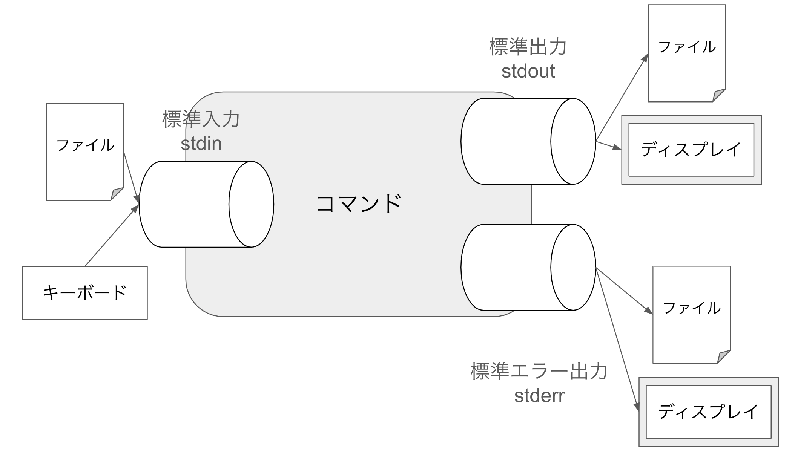

# Chapter07 標準入出力

本章では，Linuxのコマンドを繋ぎ合わせて実行する上で重要となる標準入出力について説明する．Linuxのコマンドはできることが非常にシンプルになるよう設計されている．シンプルなコマンドを繋ぎ合わせることで複雑な処理を行う．7.1ではコマンド間で情報をやりとりする仕組みを説明する．7.2では標準入出力先を変更するリダイレクトについて説明する．7.3ではコマンド間を繋ぐパイプについて説明する．

## 7.1 標準入出力

Linuxのプログラムには「1つの入り口と2つの出口」が存在する．入り口を標準入力といい，2つの出口を標準出力・標準エラー出力という．

- 標準入力
    - プログラムに入るデータを指す．
    - キーボードやファイルなどから入力される．
- 標準出力
    - プログラムの実行結果を書き出す先を指す．
    - ディスプレイやファイルなどに出力される．
- 標準エラー出力
    - プログラムのエラーメッセージを書き出す先を指す．
    - ディスプレイやファイルなどに出力される．



## 7.2 リダイレクト

リダイレクトとは標準入出力先を変更する機能である．

リダイレクトの記号は以下の通りである．

| 記号 | 意味 |
| --- | --- |
| `<` FILE | 標準入力をFILEに変更する |
| `>` FILE | 標準出力をFILEに変更する |
| `>>` FILE | 標準出力の出力先をFILE末尾に追記する |
| `2>` FILE | 標準エラー出力をFILEに変更する |
| `2>>` FILE | 標準エラー出力の出力をFILEの末尾に追記する |
| `>` FILE `2>&1` | 標準出力と標準エラー出力を共にFILEに変更する |

以下のコマンドは下準備である．

```bash
cd ~
mkdir chapter7
cd ~/chapter7
touch a b c    # ファイルを作成
```

### 標準入力のリダイレクト

標準入力のリダイレクトには`<`を使う．

### 標準出力のリダイレクト

標準出力のリダイレクトには`>`を使う．

例

```bash
ls -l    # 画面に表示される
ls -l > ls.txt    # lsの標準出力をls.txtに変更する．画面に出力されない
cat ls.txt
```

### 標準エラー出力のリダイレクト

通常，コマンドを実行してエラーが起きると画面にエラーメッセージが出力される．これは標準エラー出力も基本的に画面に表示される設定になっているためである．

```bash
ls /xxxxxxx   # エラーメッセージが出る
ls > ls_stdout.txt    # 標準出力先をls_stdout.txtにする．しかし画面にはエラーが出る
cat ls_stdout.txt     # ファイルには何もない
ls 2> ls_stderr.txt   # 標準エラー出力先を変更する
```

### 標準出力と標準エラーをまとめて出力する

`>`で標準出力をリダイレクトした後ろに`2>&1`と書く．

例

```bash
ls /xxxxxx > out_err.txt 2>&1    # 標準出力と標準エラーをまとめて書き込む
cat out_err.txt
ls ~ >> out_err.txt 2>&1         # 末尾に追記する
cat out_err.txt
```

## 7.3 パイプ

パイプとはコマンドの標準出力を別のコマンドの標準入力に繋ぐ機能である．`|`コマンドを使って実行する．パイプを使うことでコマンドを繋ぎ複雑な処理を行う．

書式

```bash
<コマンド1> | <コマンド2> ...
```

例

```bash
history | less    # コマンド履歴をページャで読む
ps aux | grep hoge     # プロセスのうちhogeと書かれた行をgrepで抽出する
du -b /bin/* | sort -n    # duコマンドでファイルやディレクトリの使用容量を調べ，数値順にソートする
```