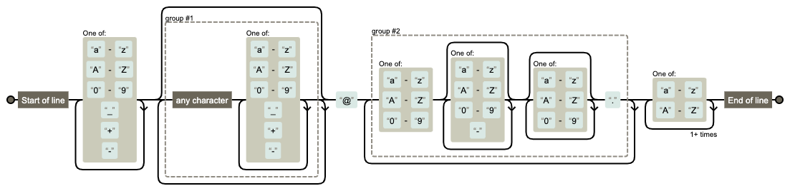

# Chapter09 正規表現

正規表現とは，様々な文字列を1つの文字列で表現する方法である．つまり，文字のパターンを記述することになる．文字のパターンとは，例えば数字で始まる文字列や，aで始まりbで終わる任意の長さの文字列などである．正規表現は検索や置換で非常に効果を発揮する．特にデータ分析におけるテキストデータの前処理で役立つ．

ここでは基本的な正規表現を解説し，さらに深く学びたい場合は各自で学習するとよい．

## 9.1 メタ文字

文字列のパターンを作るには，一つの文字で複数の意味を表す文字が必要となる．そこでメタ文字が使われる．メタ文字とは，特殊な意味や機能を持つ文字である．

| メタ文字 | 読み方 | 説明 | 使用例 | 使用例の説明 |
| --- | --- | --- | --- | --- |
| `.`  | ピリオド | 任意の1文字 | `a.c`  | "a"の後に任意の1文字が来てから"c"が来る文字列にマッチする． |
| `^` | キャレット | 行の先頭 | `^Start`  | 文字列の先頭が"Start"で始まる場合にマッチする． |
| `$` | ダラー | 行の末尾 | `end$` | 文字列の末尾が"end"で終わる場合にマッチする． |
| `*` | アスタリスク | 直前の要素が0回以上繰り返される | `go*gle`  | "g"の後に0回以上の"o"が続いた後に"gle"が来る文字列にマッチする．例えば"google"や"ggle"にマッチする． |
| `+` | プラス | 直前の要素が1回以上繰り返される | `go+gle`  | "g"の後に1回以上の"o"が続いた後に"gle"が来る文字列にマッチする．例えば"google"にはマッチするが，"gle"にはマッチしない． |
| `?` | クエスチョン | 直前の要素が0回または1回繰り返される | `colou?r` | "colour"または"color"という文字列にマッチする． |
| `[]`  | 角括弧 | 文字の集合．`-`で範囲を表す． | `[aiueo]` `[0-9]` `[a-z]` | a，i，u，e，oのいずれかの文字にマッチする． |
| `{}` | 中括弧 | 繰り返し回数を指定 | `[0-9]{3}` | 3桁の数字にマッチする． |
| `()` | 丸括弧 | グループ化 | `(go)+`  | "go"という文字列が1回以上繰り返される文字列にマッチする． |
| `|` | パイプ | 和集合を表す | `(apple|orange)` | "apple"または"orange"という文字列にマッチする． |
| `\` | バックスラッシュ | 特殊文字のエスケープや特殊シーケンスの指定 | `\.`  | ピリオド(.)自体にマッチする． |

## 9.2 特殊文字

`\`を使うことで特殊文字とすることができる．

| 記号 | 意味 |
| --- | --- |
| `\d` | 0-9の数字 |
| `\D` | 数字以外の文字 |
| `\s` | 空白文字，タブ，改行 |
| `\S` | 空白文字以外の文字 |
| `\w` | アルファベット，数字，_ (アンダースコア) |
| `\W` | アルファベット，数字，_ 以外の文字 |
| `\n`  | 改行 |

## 9.3 正規表現のチェック方法

自分が書いた正規表現が分からなくなったり，他人が書いた正規表現の意味が分からないこともある．そのような時に正規表現を可視化できるサイトがあるので紹介する．

- [regexper.com](https://regexper.com/#) : 正規表現を可視化できるサイト
- [正規表現チェッカー | WEB ARCH LABO (oscasierra.net)](https://weblabo.oscasierra.net/tools/regex/) : 実際に正規表現と文字列を書いて確かめることができるサイト

例えばメールアドレス(foo_bar@example.com)をチェックする正規表現は下記のようになる([メールアドレスの正規表現 | 正規表現入門 (javadrive.jp)](https://www.javadrive.jp/regex-basic/sample/index13.html))．

```bash
^[a-zA-Z0-9_+-]+(\.[a-zA-Z0-9_+-]+)*@([a-zA-Z0-9][a-zA-Z0-9-]*[a-zA-Z0-9]*\.)+[a-zA-Z]{2,}$
```

この正規表現だけ見ても分かりにくいが，上記の正規表現可視化サイトを使うことでイメージを掴むことができる．



## 9.4 正規表現に慣れよう

正規表現に関するクイズを5問出すので，一度考えてみてほしい．

問題

1. aで始まりeで終わる単語を正規表現で表せ．
2. aで始まりeで終わる5文字の単語を正規表現で表せ．
3. 日本の郵便番号(3桁の数字，ハイフン，4桁の数字 例: 123-4567)の形式を正規表現で表せ．
4. アメリカ英語では"or"，イギリス英語では"our"となる単語で，どちらでもfavoriteという意味を持つ単語を表す正規表現を考えよ．
5. ○○山という単語をアルファベット表記した時，"san"，"zan"，"yama"がある．これらを表す正規表現を考えよ．ただし，山という1文字は含めないものとする．

答え

1. `^a.*e$`
2. `^a.{3}e$`
3. `[0-9]{3}-[0-9]{4}` または `\d{3}-\d{4}`
4. `favou?rite`
5. `.+(san|zan|yama)$`